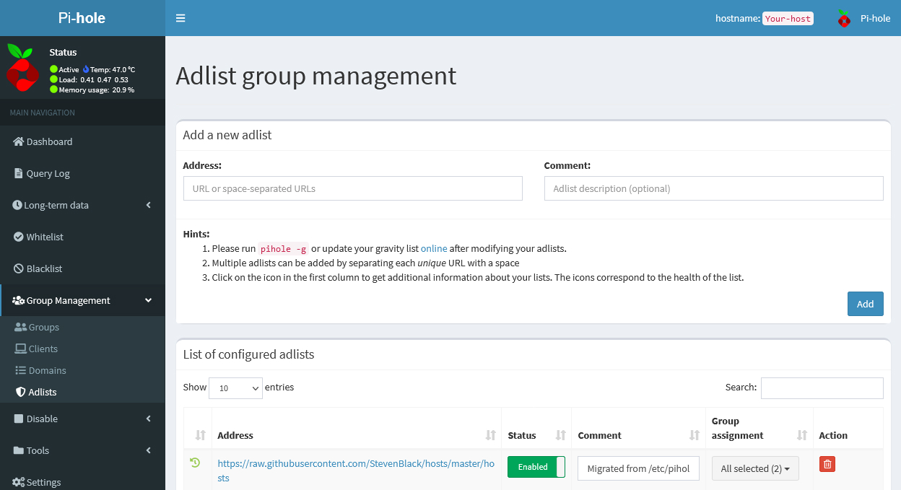

# No more Ads in my life... 🚀🎉

Pihole Configuration used at my home server

```
git clone --depth 1 https://github.com/pi-hole/pi-hole.git Pi-hole
cd "Pi-hole/automated install/"
sudo bash basic-install.sh
```

### My Issues (fast aproach)

Change admin password
> `pihole -a -p [password]`

User blocked (Db block)
```
sudo adduser www-data pihole
sudo systemctl restart apache2
```

DNS and FTL offline
> `pihole checkout master`

Other Projetcs I've used:

[spotblock-spotify from vincentkenny01](https://raw.githubusercontent.com/vincentkenny01/spotblock/master/spotify)

[whitelist-domains-whitelist from anudeepND](https://raw.githubusercontent.com/anudeepND/whitelist/master/domains/whitelist.txt)

[fanboy-annoyance from easylist](https://easylist.to/easylist/fanboy-annoyance.txt)

[ultimate-ad-filter from adavoid](https://filters.adavoid.org/ultimate-ad-filter.txt)

# How to add this lists into your Pihole

- Group Management >  Adlists > address (input some of the URL's above in here 😉)



PS: If by mistake, as I did the first time, and you need to clear your whitelist or blacklist, use ([doc](https://docs.pi-hole.net/database/gravity/)):

#### ⚠ You will not be able to undo, back up first ⚠

To Whitelist
> sudo sqlite3 /etc/pihole/gravity.db "delete from domainlist where type=0;"

To blacklist
> sudo sqlite3 /etc/pihole/gravity.db "delete from domainlist where type=1;"